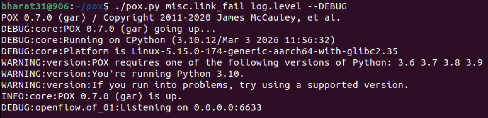
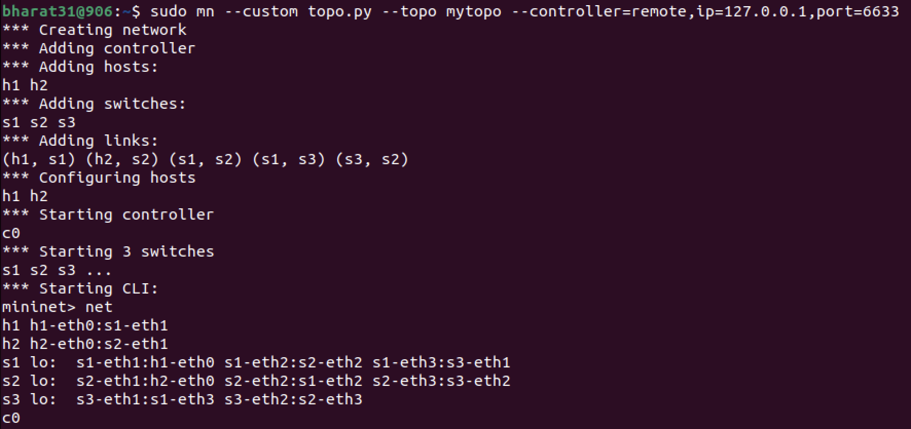
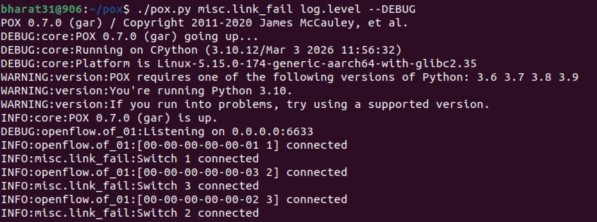
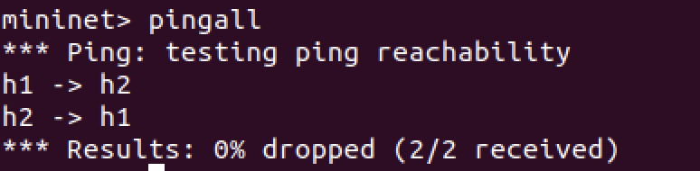
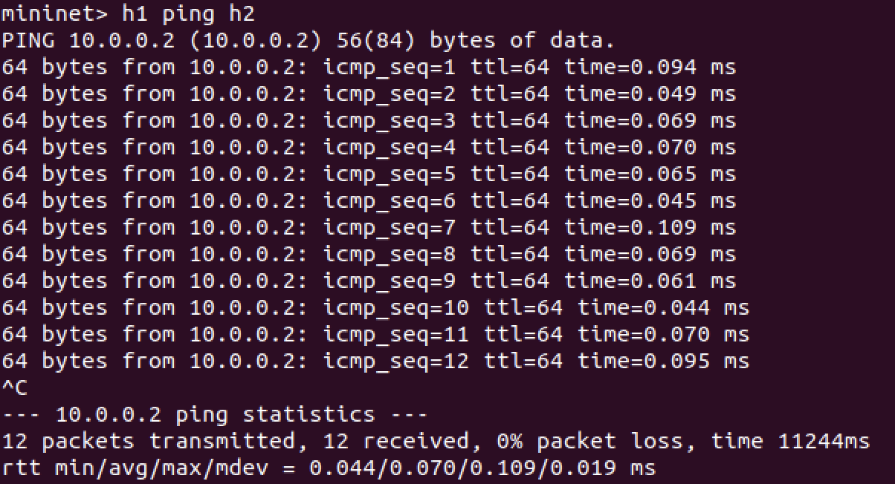
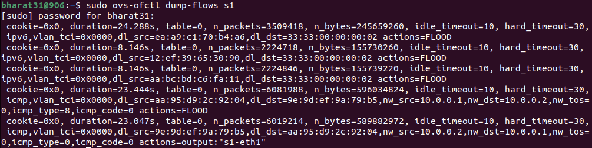
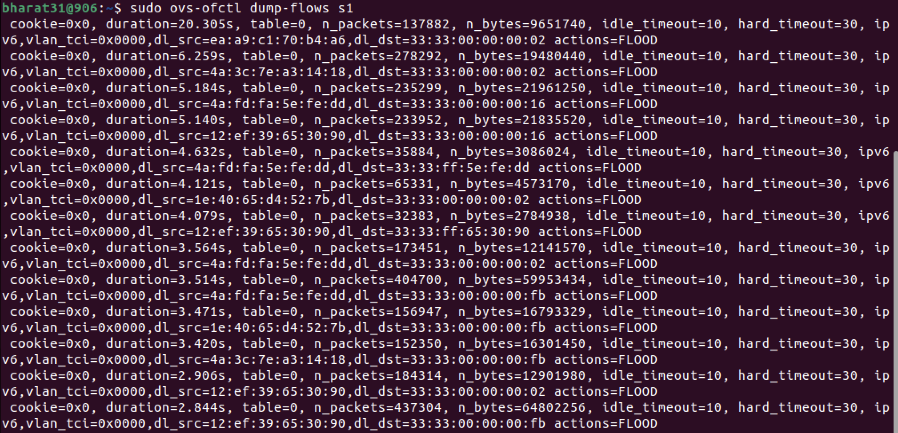
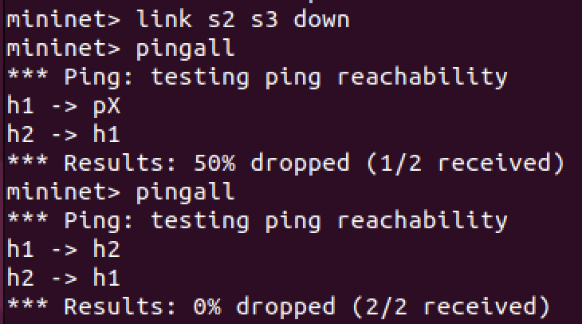
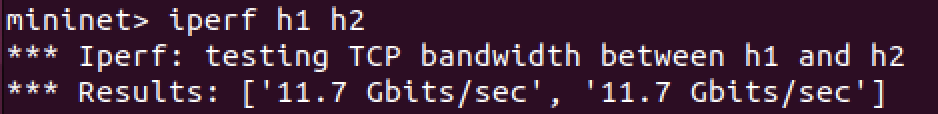

# Link Failure Detection and Recovery

> An SDN-based project demonstrating automatic link failure detection and traffic rerouting using **POX Controller** and **Mininet**.

**Author:** Bharat Shandilya | `PES2UG24CS906`

---

## Table of Contents

- [Overview](#overview)
- [Network Topology](#network-topology)
- [Project Structure](#project-structure)
- [Prerequisites](#prerequisites)
- [How to Run](#how-to-run)
- [Experiment Walkthrough](#experiment-walkthrough)
- [Results Summary](#results-summary)

---

## Overview

This project simulates a Software Defined Network (SDN) where a custom POX controller implements MAC learning and dynamic flow installation. The key goal is to observe how traffic is rerouted automatically when a link fails — demonstrating resilience in SDN architectures.

**Key concepts demonstrated:**
- OpenFlow-based MAC learning switch
- Dynamic flow rule installation with timeouts
- Link failure simulation in Mininet
- Automatic traffic rerouting via alternate paths
- Flow table inspection using `ovs-ofctl`

---

## Network Topology

```
    h1
    |
   [s1]──────[s2]──── h2
    |          |
   [s3]────────┘
```

- **2 Hosts:** `h1` (10.0.0.1), `h2` (10.0.0.2)
- **3 Switches:** `s1`, `s2`, `s3`
- **Links:**
  - `h1 ↔ s1`
  - `h2 ↔ s2`
  - `s1 ↔ s2` (direct path)
  - `s1 ↔ s3 ↔ s2` (alternate path through s3)

The redundant path through `s3` enables recovery when the direct `s1–s2` link fails.

---

## Project Structure

```
.
├── topo.py          # Custom Mininet topology definition
├── link_fail.py     # POX SDN controller with MAC learning
└── README.md
```

### `topo.py` — Mininet Topology

Defines the custom network topology with 2 hosts and 3 switches, connected with redundant links to allow rerouting.

### `link_fail.py` — POX Controller

Implements a MAC-learning OpenFlow controller:
- Listens for switch `ConnectionUp` events and logs connections.
- On `PacketIn`, learns the source MAC address and maps it to the incoming port.
- If the destination MAC is known, installs a direct forwarding rule; otherwise floods.
- Flow rules have `idle_timeout=10s` and `hard_timeout=30s` to expire stale entries and adapt to topology changes.

---

## Prerequisites

- **Mininet** (tested on Ubuntu/Linux)
- **POX Controller** (`pox` directory in home folder)
- **Open vSwitch** (`ovs-ofctl` for flow inspection)
- Python 3.6–3.9 recommended (project runs on 3.10 with warnings)

---

## How to Run

### Step 1 — Start the POX Controller

Open a terminal and run:

```bash
cd ~/pox
./pox.py misc.link_fail log.level --DEBUG
```

> Leave this terminal open. The controller will listen on port `6633` and log switch connections.

---

### Step 2 — Start Mininet with Custom Topology

Open a **second terminal** and run:

```bash
sudo mn --custom topo.py --topo mytopo --controller=remote,ip=127.0.0.1,port=6633
```

> This launches the network with the custom topology and connects it to the POX controller running locally.

---

### Step 3 — Verify the Network Layout

Inside the Mininet CLI:

```
mininet> net
```

---

### Step 4 — Test Initial Connectivity

```
mininet> pingall
```

---

### Step 5 — Run a Continuous Ping

```
mininet> h1 ping h2
```

Press `Ctrl+C` to stop after a few packets.

---

### Step 6 — Inspect Flow Tables

In a separate terminal (outside Mininet):

```bash
sudo ovs-ofctl dump-flows s1
```

Run this once during normal operation and once after the link failure.

---

### Step 7 — Simulate Link Failure

Inside the Mininet CLI:

```
mininet> link s2 s3 down
mininet> pingall
```

Wait a few seconds, then run `pingall` again to observe recovery.

---

### Step 8 — Test Bandwidth

```
mininet> iperf h1 h2
```

---

## Experiment Walkthrough

### 1. Starting the POX Controller



The POX controller (v0.7.0) starts up and listens on `0.0.0.0:6633` for incoming OpenFlow connections. At this stage no switches are connected yet. A Python 3.10 compatibility warning is shown — the controller still functions correctly.

---

### 2. Launching Mininet and Verifying Topology



Mininet starts and creates the full network:
- Hosts `h1` and `h2` are added
- Switches `s1`, `s2`, `s3` are added
- All 5 links are established: `(h1,s1) (h2,s2) (s1,s2) (s1,s3) (s3,s2)`

The `net` command confirms correct port assignments. For example, `s1` connects to `h1` via `s1-eth1`, to `s2` via `s1-eth2`, and to `s3` via `s1-eth3`.

---

### 3. Switches Connect to the POX Controller



All three switches (`Switch 1`, `Switch 3`, `Switch 2`) successfully register with the POX controller via OpenFlow. The controller logs each connection with its datapath ID (dpid). This confirms the control plane is fully operational.

---

### 4. Initial Connectivity Test — `pingall`



`pingall` confirms full end-to-end reachability: `h1 → h2` and `h2 → h1` both succeed. **0% packet drop** confirms the MAC-learning controller is installing correct flow rules.

---

### 5. Continuous Ping — `h1 ping h2`



A sustained ping from `h1` to `h2` over 12 packets shows:
- **0% packet loss**
- Round-trip times between **0.044 ms and 0.109 ms** (avg ~0.070 ms)

This demonstrates stable forwarding under normal conditions.

---

### 6. Flow Table Inspection (Normal Operation)



The flow table on `s1` after normal ping operation shows both IPv6 background traffic entries and learned ICMP entries. Crucially, the return ICMP path (`h2 → h1`) has been resolved to a specific port: `actions=output:"s1-eth1"` — confirming the MAC-learning controller has successfully learned where `h1` lives. The outbound ICMP path (`h1 → h2`) still uses `actions=FLOOD` since `h2`'s MAC was not yet resolved from this switch's perspective. All entries carry `idle_timeout=10` and `hard_timeout=30` as configured.

---

### 7. Flow Table — After Link Failure and Recovery



The flow table on `s1` captured around the link failure and recovery period shows all entries using `actions=FLOOD` — including IPv6 multicast traffic. The controller is re-flooding traffic after stale flow entries expired due to the link failure. The absence of specific output port rules means the controller has not yet re-learned the topology, and is flooding on all ports while rebuilding the MAC table via the remaining available path.

---

### 8. Link Failure and Recovery




The first `pingall` after the failure shows **50% packet drop** — `h1 → h2`. This is the initial disruption caused by stale flow entries pointing to the downed link.

**After recovery:** Running `pingall` again shows **0% packet drop**. Once the flows expire (within `idle_timeout=10s`), the controller re-learns the topology and installs new rules via the available path (`s1 → s2` direct link), fully restoring connectivity.

---

### 9. Bandwidth Test — `iperf`



An `iperf` TCP bandwidth test between `h1` and `h2` reports **11.7 Gbits/sec** in both directions. This reflects the virtual link capacity in Mininet functioning at full throughput.

---

## Results Summary

| Test | Result |
|---|---|
| Initial `pingall` | ✅ 0% packet loss |
| `h1 ping h2` (sustained) | ✅ 0% loss, avg RTT ~0.070 ms |
| Flow table learning | ✅ ICMP flows correctly installed |
| Link failure (`s2–s3 down`) | ⚠️ 50% loss on first pingall |
| Post-recovery `pingall` | ✅ 0% loss restored via alternate path |
| `iperf` bandwidth | ✅ 11.7 Gbits/sec (both directions) |

**Key Takeaway:** The POX MAC-learning controller with short flow timeouts (`idle_timeout=10s`) enables automatic recovery from link failures. Stale entries expire quickly, allowing the controller to reinstall correct forwarding rules through the available redundant path.
├── link_fail.py     # POX SDN controller with MAC learning
└── README.md
```

### `topo.py` — Mininet Topology

Defines the custom network topology with 2 hosts and 3 switches, connected with redundant links to allow rerouting.

### `link_fail.py` — POX Controller

Implements a MAC-learning OpenFlow controller:
- Listens for switch `ConnectionUp` events and logs connections.
- On `PacketIn`, learns the source MAC address and maps it to the incoming port.
- If the destination MAC is known, installs a direct forwarding rule; otherwise floods.
- Flow rules have `idle_timeout=10s` and `hard_timeout=30s` to expire stale entries and adapt to topology changes.

---

## Prerequisites

- **Mininet** (tested on Ubuntu/Linux)
- **POX Controller** (`pox` directory in home folder)
- **Open vSwitch** (`ovs-ofctl` for flow inspection)
- Python 3.6–3.9 recommended (project runs on 3.10 with warnings)

---

## How to Run

### Step 1 — Start the POX Controller

Open a terminal and run:

```bash
cd ~/pox
./pox.py misc.link_fail log.level --DEBUG
```

> Leave this terminal open. The controller will listen on port `6633` and log switch connections.

---

### Step 2 — Start Mininet with Custom Topology

Open a **second terminal** and run:

```bash
sudo mn --custom topo.py --topo mytopo --controller=remote,ip=127.0.0.1,port=6633
```

> This launches the network with the custom topology and connects it to the POX controller running locally.

---

### Step 3 — Verify the Network Layout

Inside the Mininet CLI:

```
mininet> net
```

---

### Step 4 — Test Initial Connectivity

```
mininet> pingall
```

---

### Step 5 — Run a Continuous Ping

```
mininet> h1 ping h2
```

Press `Ctrl+C` to stop after a few packets.

---

### Step 6 — Inspect Flow Tables

In a separate terminal (outside Mininet):

```bash
sudo ovs-ofctl dump-flows s1
```

Run this once during normal operation and once after the link failure.

---

### Step 7 — Simulate Link Failure

Inside the Mininet CLI:

```
mininet> link s2 s3 down
mininet> pingall
```

Wait a few seconds, then run `pingall` again to observe recovery.

---

### Step 8 — Test Bandwidth

```
mininet> iperf h1 h2
```

---

## Experiment Walkthrough

### 1. Starting the POX Controller


The POX controller (v0.7.0) starts up and listens on `0.0.0.0:6633` for incoming OpenFlow connections. At this stage no switches are connected yet. A Python 3.10 compatibility warning is shown — the controller still functions correctly.

---

### 2. Launching Mininet and Verifying Topology


Mininet starts and creates the full network:
- Hosts `h1` and `h2` are added
- Switches `s1`, `s2`, `s3` are added
- All 5 links are established: `(h1,s1) (h2,s2) (s1,s2) (s1,s3) (s3,s2)`

The `net` command confirms correct port assignments. For example, `s1` connects to `h1` via `s1-eth1`, to `s2` via `s1-eth2`, and to `s3` via `s1-eth3`.

---

### 3. Switches Connect to the POX Controller


All three switches (`Switch 1`, `Switch 3`, `Switch 2`) successfully register with the POX controller via OpenFlow. The controller logs each connection with its datapath ID (dpid). This confirms the control plane is fully operational.

---

### 4. Initial Connectivity Test — `pingall`


`pingall` confirms full end-to-end reachability: `h1 → h2` and `h2 → h1` both succeed. **0% packet drop** confirms the MAC-learning controller is installing correct flow rules.

---

### 5. Continuous Ping — `h1 ping h2`


A sustained ping from `h1` to `h2` over 12 packets shows:
- **0% packet loss**
- Round-trip times between **0.044 ms and 0.109 ms** (avg ~0.070 ms)

This demonstrates stable forwarding under normal conditions.

---

### 6. Flow Table Inspection (Normal Operation)


The flow table on `s1` under normal operation shows many entries — primarily IPv6 multicast traffic (destination `33:33:00:00:00:02`) being flooded. All entries carry `idle_timeout=10` and `hard_timeout=30` as configured. 

---

### 7. Flow Table — After Ping (ICMP Entries Visible)


After pinging, the controller has learned both directions of ICMP traffic:
- Traffic from `h1 (10.0.0.1)` → `h2 (10.0.0.2)` uses `actions=FLOOD` (destination not yet fully resolved on this switch's port)
- Return ICMP traffic `h2 → h1` is forwarded directly: `actions=output:"s1-eth1"` — showing that the MAC address of `h1` has been learned on port `s1-eth1`

This confirms the MAC-learning mechanism is working correctly.

---

### 8. Link Failure and Recovery


**Simulating failure:**
```
mininet> link s2 s3 down
```

The first `pingall` after the failure shows **50% packet drop** — `h1 → h2` fails while `h2 → h1` still succeeds (using a cached flow rule). This is the initial disruption caused by stale flow entries pointing to the downed link.

**After recovery:** Running `pingall` again shows **0% packet drop**. Once the stale flows expire (within `idle_timeout=10s`), the controller re-learns the topology and installs new rules via the still-available path (`s1 → s2` direct link), fully restoring connectivity.

---

### 9. Bandwidth Test — `iperf`


An `iperf` TCP bandwidth test between `h1` and `h2` reports **11.7 Gbits/sec** in both directions. This reflects the virtual link capacity in Mininet (software-emulated) and confirms the data plane is functioning at full throughput.

---

## Results Summary

| Test | Result |
|---|---|
| Initial `pingall` | ✅ 0% packet loss |
| `h1 ping h2` (sustained) | ✅ 0% loss, avg RTT ~0.070 ms |
| Flow table learning | ✅ ICMP flows correctly installed |
| Link failure (`s2–s3 down`) | ⚠️ 50% loss on first pingall |
| Post-recovery `pingall` | ✅ 0% loss restored via alternate path |
| `iperf` bandwidth | ✅ 11.7 Gbits/sec (both directions) |

**Key Takeaway:** The POX MAC-learning controller with short flow timeouts (`idle_timeout=10s`) enables automatic recovery from link failures. Stale entries expire quickly, allowing the controller to reinstall correct forwarding rules through the available redundant path.
